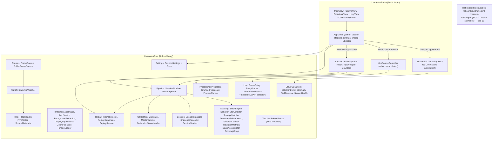
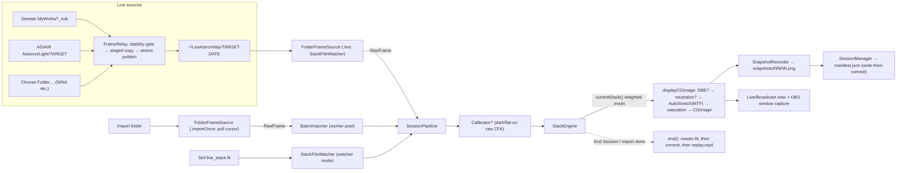
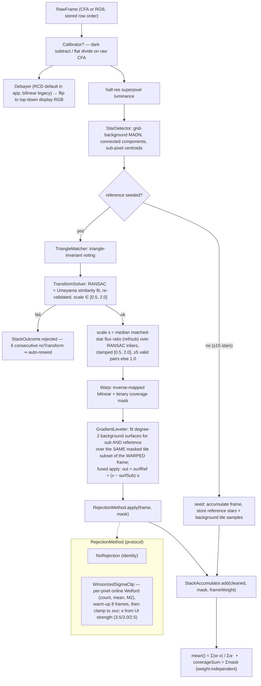
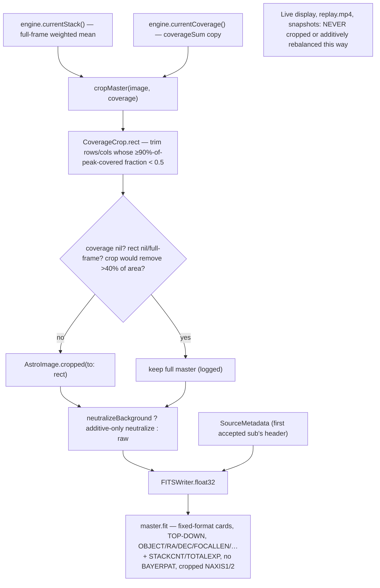
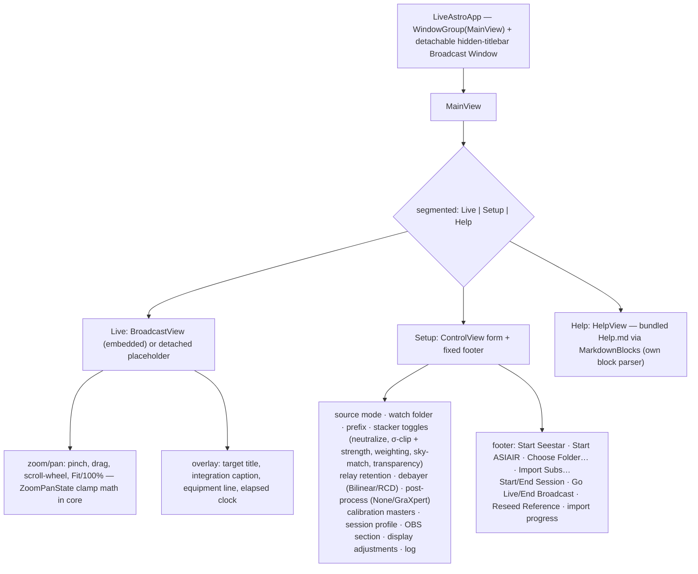

# LiveAstro Studio — Architecture

Current architecture of LiveAstro Studio: a macOS app for **live astrophotography
stacking + broadcast** plus a **native FITS batch stacker**. Swift Package,
four source targets — a UI-free core library, a SwiftUI app, and two
test-support executables — plus one test target, with zero external
dependencies. The core uses Foundation,
CoreGraphics, ImageIO, AVFoundation, CryptoKit and Combine (plus one AppKit
import in `ReplayGenerator` for caption text drawing — no UI); SwiftUI/AppKit
proper live in the app target only.

> Diagrams use [Mermaid](https://mermaid.js.org/); GitHub renders them inline.
> This document describes what the code does today; history and design
> rationale live in `docs/history/`.

## 1. Packages & subsystems

## 2. Live & import data flow

Live capture and offline import feed the **same** native-stack path
(`SessionPipeline` → `StackEngine`). Live sources are relay-backed: a
`FrameRelay` stage-copies new subs off the (possibly slow SMB) capture folder
into a local relay dir, which a `StackFileWatcher` inside `FolderFrameSource`
watches. Import is a pull-based finite source over the same engine, fanned out
across a worker pool by `BatchImporter`. The v1 watcher mode (Siril
`live_stack.fit` output, no native stacking) still exists as a third path.

- **Session-scoped relay**: `FrameRelay` snapshots the source folder at start
  and copies only files that appear afterward. A file is published only after a
  two-tick (size, mtime) stability gate plus a short within-tick re-stat, is
  staged as a hidden `.<name>.relaytmp` in the destination, re-verified against
  the source, then atomically renamed into place — a downstream watcher never
  sees a partial file under its final name. A size-mismatched (truncated)
  destination left by a crash is healed via atomic replace, logged once.
  `RelayPruner` age-prunes old relay dirs (date parsed from the dir *name*)
  before each new session, excluding the incoming one (default 7 days, 0 = off).
- **StackFileWatcher**: DispatchSource + poll fallback; emits a file only after
  (size, mtime) is stable across two scans AND (for FITS) the file length
  covers the header-declared data size; dedupes by content digest (SHA-256 of
  size + first/last 64 KB). If the watched folder disappears it logs once,
  cancels the stale fd, and clears pending stability observations; on return it
  re-arms the DispatchSource *before* claiming recovery (retrying on later
  polls if the re-arm fails). Emitted-digest state survives the gap.
- **Auto-detect one-tap paths** (`LiveSourceController`): *Start Seestar* scans
  `/Volumes/*/MyWorks/*_sub` and parses target + exposure from filenames;
  *Start ASIAIR* scans `/Volumes/*/Autorun/Light/*` and reads target/exposure
  from the newest FITS header (clearing the filename prefix — ASIAIR lights
  aren't guaranteed to start with `Light_`); *Choose Folder…* reads the newest
  FITS header of any rig folder. Each path fills the session draft, starts a
  relay, saves settings, and starts the session; detection runs off-main.

## 3. StackEngine internals (per accepted frame)

Registration runs on half-res superpixel luminance; accumulation is full-res.
Order per frame: debayer → star detect → triangle match → RANSAC/Umeyama →
warp → gradient leveling (+ fused transparency scaling) → rejection →
quality-weighted accumulate.

Key mechanics, all verified in `Sources/LiveAstroCore/Stacking/`:

- **Leveling-gated scaling.** Multiplicative transparency scaling only runs
  when gradient leveling is also on (`scaleNormalization && normalization` in
  `StackEngine.init`): scaling pivots about the reference background *surface*,
  which only exists when leveling fit it — a scalar pivot on an unleveled sub
  injects a per-sub pedestal. Scaling is all-or-nothing across channels
  (`GradientLeveler.scalingApplies`): any channel missing a sub/ref coefficient
  pair suppresses scale for the whole frame (partial scaling would color-shift
  the sub). When the per-frame fit fails, neither leveling nor scaling happens.
- **Weighting uses the APPLIED scale.** Frame weight = star-count and
  background-σ terms relative to the seed baseline, clamped [0.25, 4.0], with
  σ multiplied by the *effective* scale (σ·s when scaling applied, σ·1 when
  suppressed) — scaling amplifies noise, and a scale-suppressed dim frame must
  not be over-weighted. Both the live path and the import worker resolve
  `scalingApplies` before computing the weight.
- **StackAccumulator** keeps `sum` (Σ weight·mask·pixel), `weight`
  (Σ weight·mask — the mean's denominator) and a separate `coverageSum`
  (Σ mask — geometric frame count), so `CoverageCrop` sees true coverage, not
  quality weighting.
- **Concurrency.** One `NSLock` serializes `process()/reseed()/currentStack()`;
  intra-frame hot loops (debayer, warp, accumulate, leveling) parallelize over
  row bands (`Parallel.rows`). Import inverts this: `BatchImporter` runs
  register+warp+leveling-fit frame-per-core (pool ≤ 6, workers single-threaded
  via `minRows: .max`) with a single serial consumer committing in completion
  order; reference state is immutable during the batch, so
  `register`/`warp`/`levelingModels` are lock-free.
- **Auto-reseed.** Six consecutive `noTransform` rejections clear the reference
  (probably a wrong-target seed) so the next ≥15-star frame re-seeds; rejection
  stats reset with it. Manual **Reseed Reference** does the same on demand.

## 4. Master finalize / export

At session end the master is **cropped to the covered region**, then
**additive-only** background-neutralized (kills the OSC skyglow cast while
staying linear/calibratable for downstream SPCC), then written as a
header-complete float32 FITS.

`SessionPipeline.end()` (synchronous, called off-main) drains the consumer with
a bounded two-stage timeout (10 s, then cancel + 5 s grace) and **refuses to
finalize** (`shutdownTimeout`) if the consumer won't stop — a racing consumer
could corrupt the master; import mode drains completely. Replay:
`ReplayService.regenerate` re-reads manifest + snapshots, applies the cloud
**quality gate** (drop snapshots whose linear background median deviates >50%
from the median of the last 5 accepted; first/last always kept), picks ≤45
log-spaced keyframes with near-duplicate removal, and renders a 45 s 1080p
`replay.mp4` (AVFoundation, crossfades, caption overlay). Needing only
manifest + snapshots, the replay is regenerable at any time after the session
(the app's *Regenerate Replay…*).

## 5. Session durability & the fault-injection instrument

The invariant that governs every persistence boundary (quoted from
`docs/superpowers/fault-matrix.md`, which is the living matrix of
boundary × fault cells):

> A boundary failure may lose or reject one frame; it must never invalidate,
> silently corrupt, or prevent recovery of the session. **Every degradation
> must appear honestly in the log.**

How the code holds it:

- **Write-then-commit manifests.** `SessionManager` persists a *proposed*
  manifest (atomic temp+rename via `Data(.atomic)`) before mutating in-memory
  state, for start, per-snapshot record, and end — a failed write can never
  leave counted-but-unpersisted state.
- **Master before commit point.** `SessionPipeline.end()` writes `master.fit`
  *before* `endSession()` stamps `end_time` — the commit point. A failed master
  write leaves the manifest truthfully still-running (end_time nil) and
  surfaces the error.
- **Transactional startup.** If a source/watcher fails to start after the
  session dir was created, the session is rolled back (no orphan running dir,
  retry is clean).
- **The oracle** (`Tests/LiveAstroCoreTests/FaultKit/OracleAssert.swift`) is
  every fault test's final assertion, six clauses: (1) manifest parses;
  (2) listed snapshots exist, count truthful; (3) later valid frames still
  accepted; (4) every listed snapshot decodes as a real image; (5) a manifest
  with `end_time` set must have a durable `master.fit`; (6) the log matches the
  expected degradation pattern.
- **Crash cells use a real SIGKILL.** `Sources/faulthelper` drives real
  `SessionManager`/`FrameRelay` operations to a coordinated readiness flag and
  blocks; `CrashArtifactBuilder` SIGKILLs it mid-state and tests assert over
  the on-disk aftermath (scenarios: `session-midframes`, `manifest-midwrite`,
  `relay-midcopy`). `Sources/fakesiril` is the other test-support executable:
  a synthetic Siril livestacker that rewrites `live_stack.fit` with a
  deliberate partial-write phase, exercising the watcher's completeness gate.
- **Seam policy: the smallest possible fault seam, only for failures that
  cannot be induced reliably.** Exactly two pre-approved seams exist, both
  production no-ops: `FrameRelay.onPrePublish` (sync point between
  copy-verification and the atomic rename; `relay-midcopy` cell) and
  `SessionManager.manifestWriter` (injectable manifest write, nil in
  production → the identical atomic write; `manifest-midwrite` cell). The
  helper's injected writer performs byte-identical staging steps (same-dir
  temp + rename) and, on the challenged write, stages the full new bytes,
  sets the readiness flag, then blocks forever — so the kill deterministically
  lands between staging and publication of a challenged write; the aftermath
  proves the prior published version survives intact, beside the complete,
  closed, unpublished staged temp. (A block-point cannot be interposed inside
  production `Data(.atomic)`; the production path's crash-atomicity is
  separately covered by the APFS in-place cells.)
  Justifications live in fault-matrix.md next to their cells.

## 6. App / UI structure

The app layer is decomposed: `AppModel` (~420 lines) owns session lifecycle
(`startSession`/`wireCallbacks`/`endSession`), settings persistence, the
session-profile draft, and shared UI state (log, error, counts, latest image,
zoom/pan, tabs) — and composes three controllers through the **`AppSurface`
seam**: a struct of closures over AppModel's cross-cutting state. Controllers
hold **no back-reference to AppModel** (no retain cycles; unit-testable with
captured closures). All four are `@MainActor @Observable`. The controllers are
implicitly-unwrapped properties assigned exactly once early in `AppModel.init`
— the IUO only breaks the init-order knot (the closures capture `self`).

Controller responsibilities: **BroadcastController** — OBS config, connect +
auto-launch, Go Live state machine, health poll, stall scene automation;
**LiveSourceController** — FrameRelay lifecycle, prune, the three detect
paths; **ImportController** — `importSubs`/cancel/progress,
`regenerateReplay`, `processMaster` (GraXpert).

- **Display adjustments** (`DisplayAdjustments`, persisted): black point,
  stretch strength, saturation, optional multiscale DBE flatten — all
  non-destructive display-path only; slider changes re-render the current stack
  off-main, throttled to ~12 fps; the next snapshot uses the same adjustments.
- **Settings** (`SessionSettings`, one JSON blob in UserDefaults under
  `sessionSettings.v1`): source mode, watch folder, prefix, stacker toggles,
  calibration paths, processor backend, display adjustments, relay retention,
  demosaic. Decode is backward-compatible (missing keys default), so updates
  never wipe saved settings. Saved on start/end/import/detect/quit.
- **Sessions** land under `~/Documents/LiveAstro/<yyyy-MM-dd-target>/`
  (`manifest.json`, `snapshots/`, `master.fit`, `replay.mp4`); relay staging
  under `~/LiveAstro/relay/`; calibration masters under `~/LiveAstro/masters/`.

## 7. External processing & OBS

**Processing/** is the shipped pluggable post-stack processor integration
(`Processor` protocol; `ProcessorBackend` = `.none | .graxpert`).
`GraXpertProcessor` shells out to the user's own GraXpert install
(`/Applications/GraXpert.app/Contents/MacOS/GraXpert -cli`) running
background-extraction then denoising, producing `master_processed.fit` next to
the master; `ImportController.processMaster` gates on backend selection,
executable presence, and an existing native `master.fit`. `ProcessRunner` is
the injectable process seam. Further backends (RC-Astro, native Core ML)
remain future work.

**OBS/** is a pure-URLSession obs-websocket **5.x** stack, UI-free in core:
`OBSSocket` (URLSession WebSocket transport, injectable), `OBSClient` (actor:
Hello→Identify→Identified handshake, requestId correlation, event stream),
`OBSAuth` (CryptoKit SHA-256 challenge auth), and `OBSController` (@MainActor
state machine `disconnected→connecting→connected→streaming` + scene/record
state; every op except connect swallows errors into the log — **OBS never
blocks the astronomy session**). `BroadcastController` (app target) does the
AppKit choreography: connect with auto-launch via NSWorkspace (20 s retry
budget), **Go Live** (deliberate broadcast: set scene, StartStream, confirm via
status polls, undo on race with End), 2 s stream-health polling, and
stall-based **scene automation** — a 15 s timer checks a `StallDetector`
(threshold `max(3×subExposure, 90 s)`); on stall it switches to the scope scene
once, on the next accepted frame back to the stack scene; an operator-initiated
scene change pauses automation until the next stall/resume boundary. End
Session is the **only** place the stream is stopped — and only after replay
generation completes or fails (scene automation stops immediately at the
click); quit/crash deliberately leaves an OBS broadcast running.

## 8. Key design decisions

- **Zero external dependencies** — Apple system frameworks only; small,
  self-contained, privacy-preserving local app.
- **UI-free `LiveAstroCore`** — all imaging/stacking/session/OBS-protocol logic
  is testable without SwiftUI; the app target is a thin shell.
- **One native-stack path for live and import** — the same `SessionPipeline` +
  `StackEngine` serve both; import is a finite source with a parallel front-end.
- **Online, O(1)-in-frames stacking** — incremental weighted-mean accumulator +
  online winsorized κσ rejection; the frame set is never held in memory.
- **Pluggable seams follow one idiom** — `RejectionMethod`, `Processor`,
  `OBSSocket`, `FrameSource` are protocols with the production default shipped;
  the `AppSurface` closure bundle is the same idea at the app layer.
- **Leveling-gated scaling** — transparency scaling is active only when
  gradient leveling is on, fused as a per-pixel surface pivot
  (`out = surfRef + (x − surfSub)·s`), all-or-nothing across channels.
- **Weighting from the APPLIED scale** — frame weight uses σ·effectiveScale,
  resolved after the leveling fit and `scalingApplies` guard, so weight and
  applied scale can never disagree.
- **Calibration masters are canonical top-down, flipped to the light** —
  masters load with `normalizeRowOrder: true`; a bottom-up light gets a
  vertically flipped master so photosites align. Calibration never throws: a
  size-mismatched master is skipped and logged once.
- **FITSReader row-order normalization, off for CFA** — the reader flips
  bottom-up files to top-down by default for display consumers, but raw-sub
  loading uses `normalizeRowOrder: false`: debayering a flipped mosaic shifts
  the Bayer phase and swaps R/B. The engine debayers in stored order, then
  flips the RGB to display orientation.
- **Crop is output-stage only** — the master is cropped from a copy at export;
  the accumulator, live view, replay, and snapshots are never cropped.
- **Ecosystem-clean export** — additive-only color balance, header-complete
  (propagated from the source subs) FITS master so Siril/PixInsight
  plate-solve + SPCC work with no friction.
- **Session durability by construction** — write-then-commit manifest
  persistence, master-before-commit-point ordering, transactional startup,
  bounded drain with refusal to finalize a racing stack (§5).
- **Run live sessions from a release build** — the per-frame budget assumes
  release-build performance (debug-build per-frame cost can blow the capture
  cadence; the 26 MP perf gate runs `swift test -c release`). See
  `docs/architecture/performance-and-platesolving-trajectory.md`.
