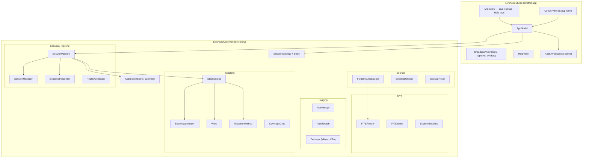
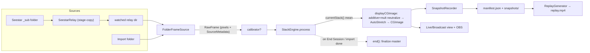
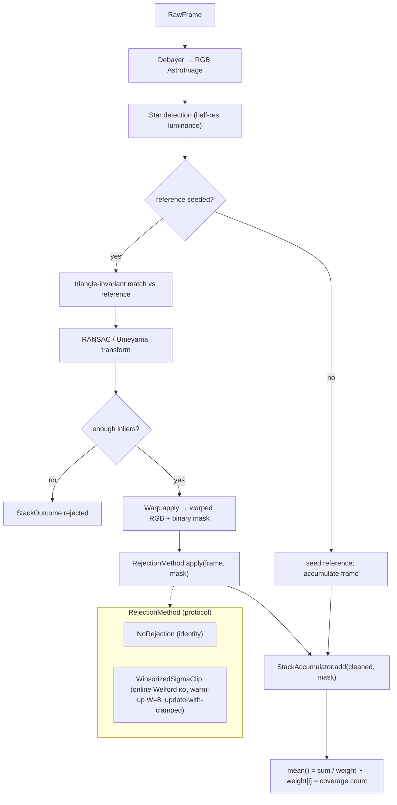
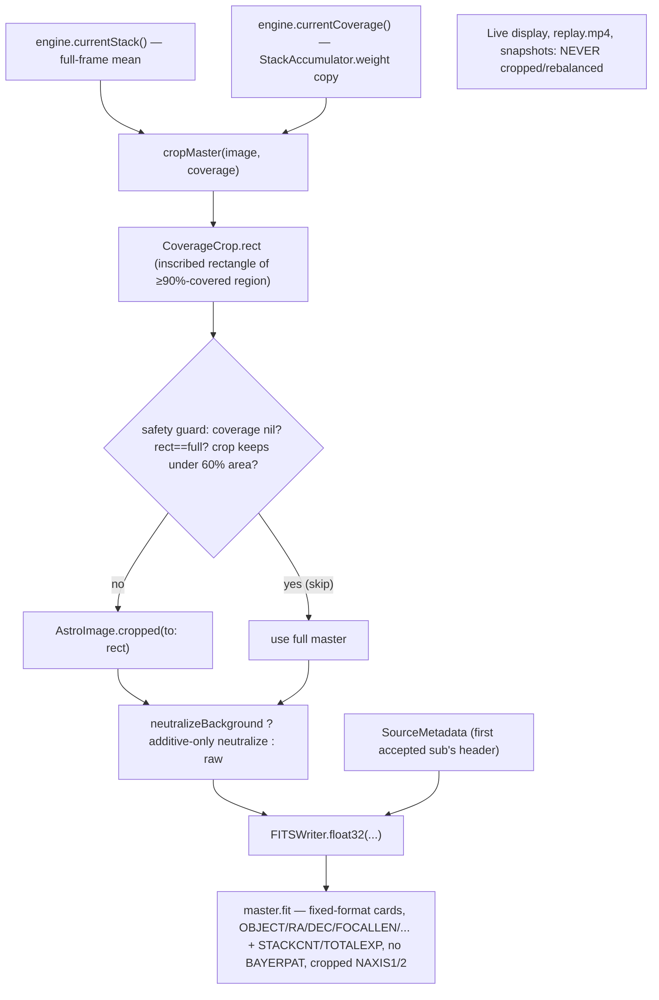
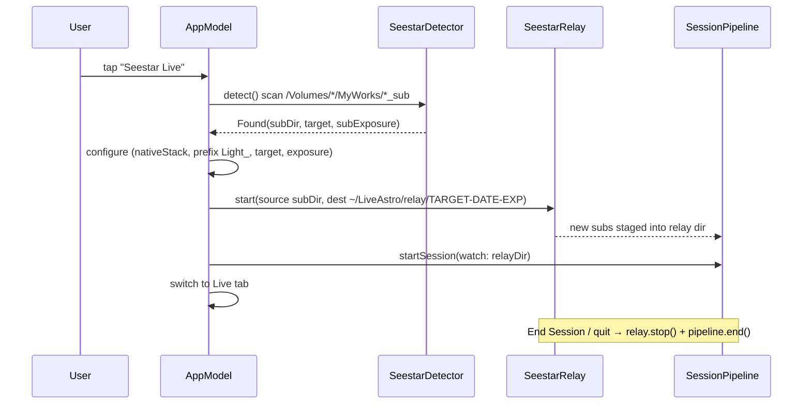
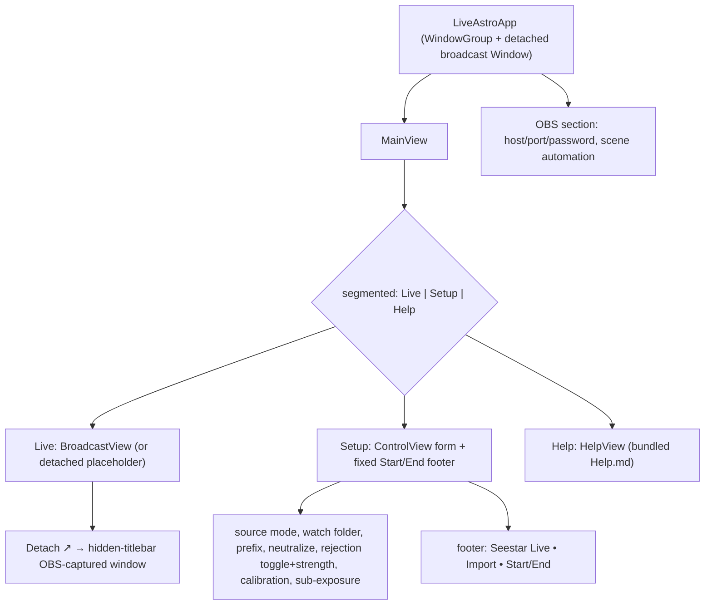
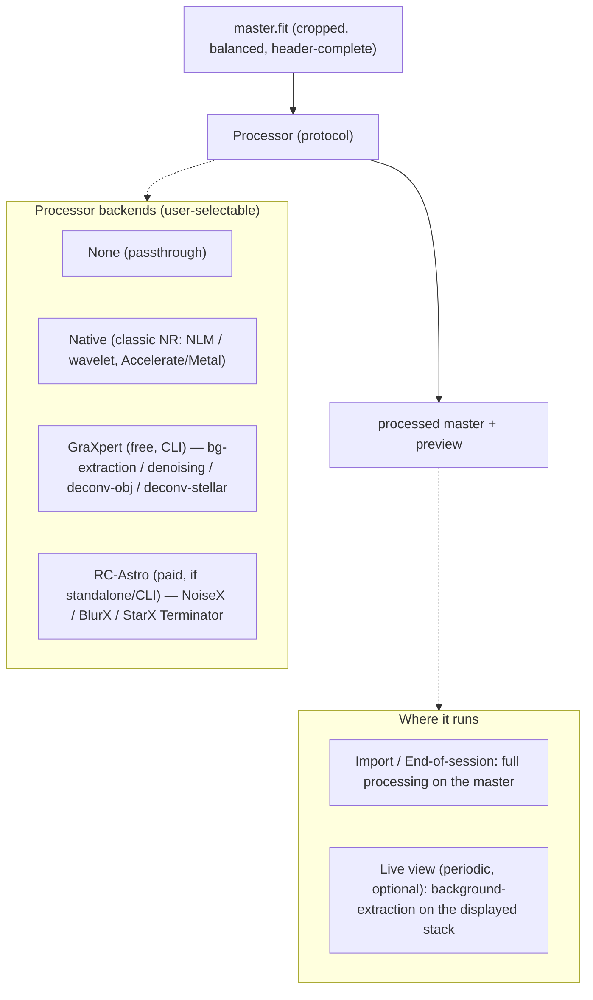

# LiveAstro Studio — Architecture

Design overview of LiveAstro Studio: a macOS app for **live astrophotography
broadcast** plus a **native FITS stacker** (live + offline import). Two Swift
Package targets — a UI-free core library and a SwiftUI app — with zero external
dependencies (Foundation, CoreGraphics, AVFoundation, Accelerate/vImage,
CryptoKit only).

> Diagrams use [Mermaid](https://mermaid.js.org/); GitHub renders them inline.

## 1. Packages & subsystems

## 2. Session pipeline — live & import data flow

Both live capture (a watched folder / Seestar relay) and offline import feed the
**same** native-stack path (`SessionPipeline.handleNative` → `StackEngine`).

## 3. StackEngine internals (per accepted frame)

Registration is triangle-invariant star matching → RANSAC/Umeyama solve → bilinear
warp with a coverage mask → pluggable rejection → incremental weighted-mean
accumulate.

## 4. Master finalize / export (the clean-export + crop-to-overlap path)

At session end the master is **cropped to the covered region**, then
**additive-only** background-neutralized (kills OSC green, stays linear for
downstream SPCC), then written as a **standard, header-complete FITS**.

## 5. One-tap Seestar Live flow

## 6. App / UI structure

## Roadmap — planned pluggable processing (NOT yet implemented)

The shipped pipeline stacks, rejects, crops, color-balances and exports. The
next pillar adds **post-stack image processing** (denoise / deconvolution /
background extraction) as a **pluggable backend** — the same pattern used for
`RejectionMethod`. Nothing below exists in the codebase yet; it documents intent.

Notes: **GraXpert is the free default** (installed standalone, CLI verified:
`GraXpert.app/Contents/MacOS/GraXpert -cli -cmd {background-extraction|denoising|deconv-obj|deconv-stellar}`);
the app calls the user's own install (can't bundle). RC-Astro is an optional
"use-what-you-own" backend where a standalone/CLI exists. A future **native**
backend (ONNX→Core ML) removes the external dependency. Real-time viability
differs by op: **background-extraction** is the live-view priority (slow-changing,
biggest visual win); denoise is mostly handled for free by stacking; deconvolution
is a final-polish step, not live. Parameter selection uses measured defaults + a
user slider (a naive auto-metric over-denoises — validated experimentally).

## Key design decisions

- **Zero external dependencies** — Apple system frameworks only, for a small,
  self-contained, privacy-preserving local app.
- **UI-free `LiveAstroCore`** — all imaging/stacking/session logic is testable
  without SwiftUI; the app is a thin shell over it.
- **One native-stack path for live and import** — `handleNative` +
  `StackEngine` serve both; import is just a bounded source.
- **Online, O(1)-in-frames stacking** — incremental weighted-mean accumulator +
  online winsorized κσ rejection; the full frame set is never held in memory.
- **Pluggable rejection** (`RejectionMethod`) — `NoRejection` default,
  `WinsorizedSigmaClip` shipped; linear-fit / GESD / RCR are future backends.
- **Crop is output-stage only** — the master is cropped from a copy at export;
  the accumulator, live view, replay, and snapshots are never cropped.
- **Ecosystem-clean export** — color-balanced (additive-only), header-complete
  (propagated from the source subs), FITS-standard master so Siril/PixInsight
  plate-solve + SPCC work with no friction.
